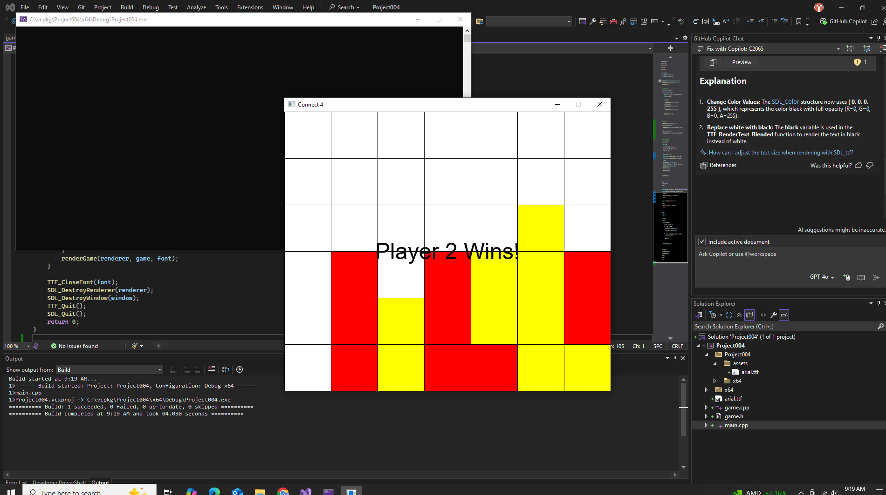

# Project 04 – Connect 4++

## 🕹️ Description

This is a turn-based grid game written in C++ using SDL2. Players take turns placing pieces using the mouse.

## 🎮 Controls

- Click the white screen to select a column  
- Click to place a piece  
- Press `R` or click "Restart" to play again  
- Press `Esc` to exit  

## 🧪 Screenshot

